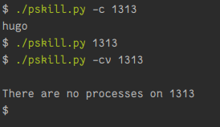

======
pskill
======

Simple command-line utility to kill process that used selected port.

-----
Usage
-----
.. code-block:: python
   :emphasize-lines: 3,5
    pskill [-v|--verbose] [-c|--check] PORT
    pskill (-l | --list)
    pskill (-h | --help)

    Options:
        -l --list           List all active processes.
        -v --verbose        Enable additional prints.
        -c --check          Get processes that used selected port.
        -h --help           Show this screen.

    Arguments:
        PORT    Number of port to kill.

